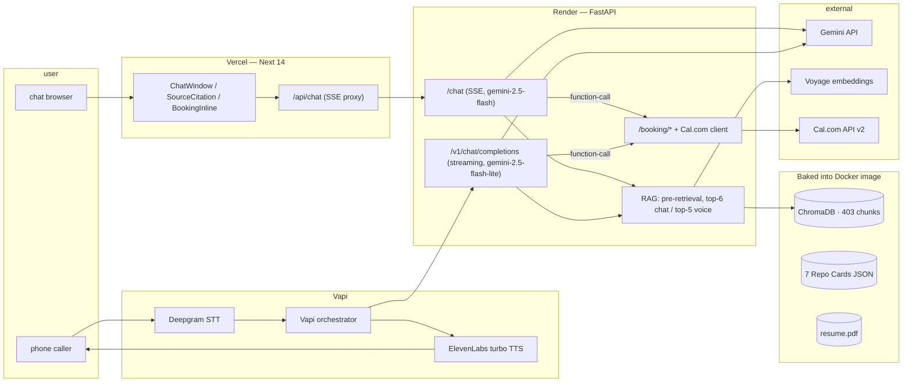

# Jiya Singhal — AI Persona

An AI representative of Jiya Singhal that an evaluator can **chat with at a public URL** or **call on a phone number**, that proposes real slots from her Cal.com calendar and books a meeting end-to-end. Every factual claim is grounded in her resume and her seven public GitHub repos — no hardcoded answers, no fabrication.

- **Live chat:** <https://jiya-persona.vercel.app>
- **Live backend:** <https://jiya-persona-backend.onrender.com>
- **Voice (Vapi assistant):** see [`vapi/SETUP.md`](./vapi/SETUP.md) — set up via the Vapi dashboard and provision a Twilio number through it.
- **1-page eval report:** [`evals/results/Jiya-Persona-Evals.pdf`](./evals/results/Jiya-Persona-Evals.pdf)

---

## 30-second pitch

The chat agent answers "why are you right for this role" with grounded specifics — swift-f0 migration, 21,750-test noise robustness suite, 98.8% pass rate, FAISS-based product search at TradeIndia — pulled from a RAG corpus over the resume PDF and auto-summarized GitHub Repo Cards. When the user expresses booking intent, the agent calls a real Cal.com tool, proposes real slots, and books a real event with a Google Meet link. On the phone, Vapi calls the same backend as a custom LLM; voice replies stream token-by-token with a measured **first-token latency of 1.0 s** in production.

## Eval highlights

Run against 20 questions covering factual recall, repo depth, fit, adversarial refusals, and booking intent. Judged by Gemini 2.5 Flash with a JSON-mode rubric.

| metric | value |
| --- | --- |
| groundedness mean | **0.917** |
| relevance mean | 0.925 |
| honesty mean | 0.902 |
| adversarial refusals (groundedness) | **1.0** |
| chat latency p50 / p95 | 2.1 s / 4.4 s |
| voice ttft p50 (Phase 5 prod smoke) | **1.0 s** (target < 2 s) |
| real Cal.com event booked end-to-end | yes |

Hallucination rate (groundedness < 0.8) is 20% — driven by one repeating cross-repo leak (FAISS+sentence-embedding details from the search-listings card bleeding into the TradeIndia narrative). This is documented in failure mode #3 of the PDF and is the first item on the two-week roadmap.

---

## Architecture



The full breakdown — model split rationale, latency playbook, known limits — is in [`architecture.md`](./architecture.md).

### Model split

| model | used for | why |
| --- | --- | --- |
| `gemini-2.5-flash` | chat agent, Repo Card generation, eval judge | best groundedness in this family |
| `gemini-2.5-flash-lite` | voice (`/v1/chat/completions`) | drops first-token from ~3.5s to ~1.0s, with the voice-mode prompt addendum compensating for shorter context |
| Voyage `voyage-3-large` (fallback `voyage-3`) | embeddings | document + query, dense retrieval into Chroma |

---

## Repo layout

```
jiya-persona/
├── README.md                          this file
├── architecture.md                    deeper writeup
├── BRIEF.md                           original assignment spec
├── DEPLOY.md                          numbered Render + Vercel + Vapi steps
├── .env.example                       config template (placeholders only)
├── backend/
│   ├── pyproject.toml
│   ├── Dockerfile / .dockerignore
│   ├── render.yaml
│   ├── app/
│   │   ├── main.py                    FastAPI entry, route mounting
│   │   ├── config.py                  pydantic-settings
│   │   ├── rag/
│   │   │   ├── resume_ingest.py       pdfplumber → sectioned chunks
│   │   │   ├── github_ingest.py       PyGithub fetch + file selector
│   │   │   ├── repo_summarizer.py     Repo Card generator (Gemini, JSON-mode)
│   │   │   ├── chunking.py            card / field / code chunk shapes
│   │   │   ├── embedder.py            Voyage wrapper
│   │   │   └── retriever.py           Chroma + MMR diversity
│   │   ├── agent/
│   │   │   ├── system_prompt.py       persona prompt + few-shots
│   │   │   ├── tools.py               function-call schemas
│   │   │   └── chat.py                /chat handler (gemini-2.5-flash)
│   │   ├── routes/
│   │   │   ├── chat.py                POST /chat (SSE)
│   │   │   ├── booking.py             POST /booking/availability + /booking/book
│   │   │   ├── openai_compat.py       POST /v1/chat/completions (Vapi custom-LLM)
│   │   │   └── voice.py               POST /vapi/tool (Vapi-managed tools)
│   │   ├── calendar_integration/
│   │   │   └── calcom.py              Cal.com v2 client
│   │   ├── telemetry/
│   │   │   └── latency_log.py         SQLite per-turn timer
│   │   └── scripts/
│   │       ├── reingest.py            full RAG rebuild CLI
│   │       ├── retrieval_smoke.py     5-query retrieval sanity check
│   │       ├── chat_smoke.py          5-question chat smoke
│   │       ├── booking_smoke.py       end-to-end booking conversation
│   │       ├── openai_shim_smoke.py   /v1/chat/completions smoke
│   │       └── prod_smoke.py          smoke against Render prod
│   └── data/
│       ├── resume.pdf                 source-of-truth resume (committed)
│       ├── repo_cards/                7 cached Repo Cards JSON (committed)
│       └── chroma_db/                 ChromaDB on disk, 403 chunks (committed)
├── frontend/
│   ├── package.json
│   ├── next.config.js / tsconfig.json / tailwind.config.ts
│   ├── app/
│   │   ├── page.tsx                   landing
│   │   ├── layout.tsx
│   │   ├── globals.css
│   │   └── api/chat/route.ts          SSE proxy to backend
│   ├── components/
│   │   ├── ChatWindow.tsx             main shell
│   │   ├── MessageBubble.tsx
│   │   ├── SourceCitation.tsx         click-to-expand citation chips
│   │   └── BookingInline.tsx          slot list + confirmation card
│   └── lib/
│       └── api.ts                     SSE event parser
├── evals/
│   ├── test_set.json                  20 questions
│   ├── run_evals.py                   runs test set, LLM-judges
│   ├── generate_report.py             ReportLab 1-page PDF
│   └── results/
│       ├── latest.json
│       └── Jiya-Persona-Evals.pdf
├── vapi/
│   ├── assistant_config.json          full Vapi assistant JSON
│   └── SETUP.md                       numbered dashboard steps
└── screenshots/                       Phase 4 + 6 UI screenshots
```

---

## Local setup

### Backend

Requires Python 3.11. Uses [uv](https://github.com/astral-sh/uv) if present, falls back to venv + pip.

```bash
cd backend

# create venv and install
uv venv .venv          # or: python3.11 -m venv .venv
uv pip install -e .    # or: .venv/bin/pip install -e .

# fill in API keys
cp ../.env.example .env
# edit .env — at minimum set GEMINI_API_KEY, VOYAGE_API_KEY, GITHUB_TOKEN,
# CALCOM_API_KEY, CALCOM_EVENT_TYPE_ID

# run
.venv/bin/uvicorn app.main:app --reload --port 8000
```

The RAG corpus is committed (`data/chroma_db/`, `data/repo_cards/`, `data/resume.pdf`), so the backend boots ready-to-go without any ingestion step. To rebuild after a resume update or new repo:

```bash
.venv/bin/python -m app.scripts.reingest                 # full rebuild
.venv/bin/python -m app.scripts.reingest --repos-only    # skip resume
.venv/bin/python -m app.scripts.reingest --force-cards   # regenerate Repo Cards
```

### Frontend

```bash
cd frontend
npm install
BACKEND_URL=http://127.0.0.1:8000 npm run dev
# open http://localhost:3000
```

### Smoke scripts

With backend running on `127.0.0.1:8000`:

```bash
cd backend
.venv/bin/python -m app.scripts.retrieval_smoke      # 5 retrieval queries
.venv/bin/python -m app.scripts.chat_smoke           # 5 chat questions
.venv/bin/python -m app.scripts.booking_smoke        # end-to-end booking
.venv/bin/python -m app.scripts.openai_shim_smoke    # voice path

# against prod:
PROD_URL=https://jiya-persona-backend.onrender.com .venv/bin/python -m app.scripts.prod_smoke
```

### Running evals

```bash
# from repo root, with backend/.env populated:
set -a; source backend/.env; set +a
backend/.venv/bin/python evals/run_evals.py
backend/.venv/bin/python evals/generate_report.py
# results land in evals/results/{latest.json, Jiya-Persona-Evals.pdf}
```

---

## Deployment

See [`DEPLOY.md`](./DEPLOY.md) for numbered Render + Vercel + Vapi steps. The short version:

1. Push to GitHub.
2. Render → New Blueprint → connect repo → fill env vars → deploy.
3. Vercel → Import → Root Directory `frontend` → set `BACKEND_URL` → deploy.
4. Vapi → create assistant from `vapi/assistant_config.json` (replace `model.url` with the Render URL) → provision a Twilio number.

The backend Docker image bakes the RAG corpus, so prod boots without any ingestion step. Render free tier sleeps after 15 min idle; either upgrade to the $7/mo warm tier during the eval window or use the keep-warm cron documented in `DEPLOY.md`.

---

## Honest limits and what I'd improve next

The eval surfaced one persistent failure: **cross-repo content leakage from the search-listings Repo Card into the TradeIndia narrative** — when asked about TradeIndia, the agent occasionally describes it using `sentence-transformers` and the 89%/96% accuracy figures from the search-listings card. The resume only says "FAISS-based product search." Documented as failure mode #3 in the PDF.

With two more weeks I'd:

1. Add a Voyage rerank-2-lite reranker on top of dense retrieval — would tighten cross-repo answers and skip irrelevant chunks on booking turns.
2. Add a multi-turn booking state machine instead of relying on Gemini to follow conversation state.
3. Ingest the SingOneSong private repo via a CI-side ingestion job (without committing the source) — the persona's strongest material lives in private repos and resume-only retrieval leaves accuracy on the table.
4. ElevenLabs custom voice cloned from Jiya's audio so the AI rep sounds like Jiya specifically.
5. Hindi → English handoff for the phone path; Vapi supports it but the current Deepgram config is en-only.

Full eval methodology, per-category breakdown, and failure-mode writeups are in [`evals/results/Jiya-Persona-Evals.pdf`](./evals/results/Jiya-Persona-Evals.pdf).
