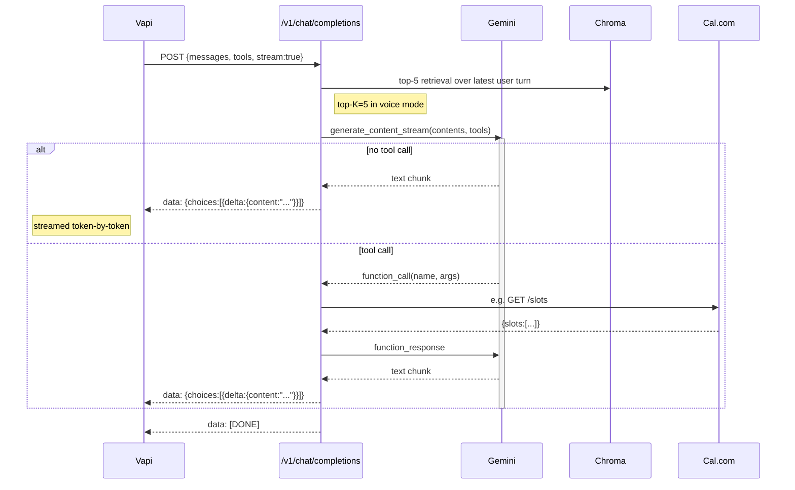
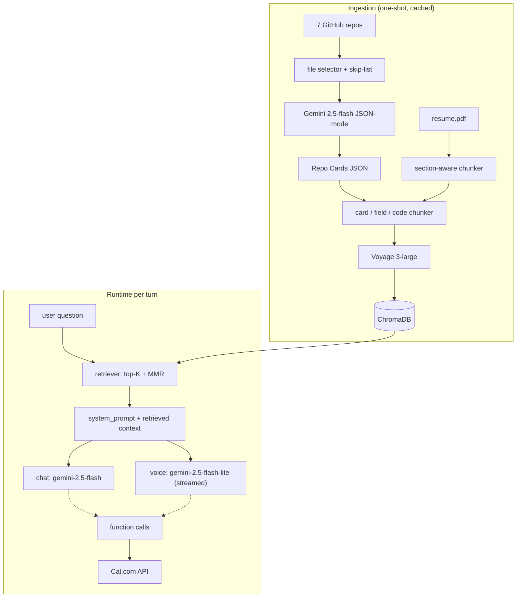

# Architecture

This document complements the [README](./README.md) with a deeper look at the design decisions behind the AI persona — what's in the RAG layer, why the two LLM models are split the way they are, how voice gets to under 2 seconds first-token, and what's known to be wrong.

## RAG pipeline

The core insight from the BRIEF: the seven public GitHub repos have **thin or missing READMEs**. A retrieval pipeline that just chunks repo files at fixed token boundaries would produce generic, low-signal context. So the ingestion does something else.

### Resume

`backend/app/rag/resume_ingest.py` parses `data/resume.pdf` with `pypdf`, splits on common section headers (Experience / Projects / Education / Skills), and emits two granularities of chunk per Experience block: a full block-level chunk for context, and bullet-level chunks for individual facts. Bullet-level granularity is what lets the agent retrieve a single number ("98.8% pass rate") in isolation rather than burying it inside a 600-word paragraph.

Each chunk gets `{source_type: "resume", section: "...", company: "..."}` metadata so the retriever can filter at query time.

### GitHub — auto-summarized Repo Cards

Per repo, `backend/app/rag/github_ingest.py` fetches metadata + a curated subset of source files (priority list: README, manifest, config, entry points; skip lockfiles, binaries, audio, generated bundles). Then `backend/app/rag/repo_summarizer.py` calls Gemini 2.5 Flash with `response_mime_type="application/json"` to produce a structured **Repo Card** with fields like `one_line_purpose`, `architecture_summary`, `tradeoffs_and_limitations`, `complexity_level`. Each card is cached to `data/repo_cards/<repo>.json` keyed by `last_commit_date` so re-ingestion only re-queries Gemini for repos that actually changed.

The card is then ingested into Chroma at three granularities:

- **Card-level**: the full JSON as one chunk — for high-level questions like "tell me about your search-listings project."
- **Field-level**: each field (purpose, architecture, tradeoffs, features, etc.) as its own chunk — for targeted questions like "what tradeoffs?"
- **Raw code**: the actual selected source files chunked at ~800 chars with 100 overlap — for questions about implementation details.

Final corpus: 403 chunks across resume (21), Repo Cards (62), and raw code (320). Embedded with Voyage `voyage-3-large` (fallback `voyage-3`).

### Retrieval

Dense top-k=12 from Chroma, then a simple per-repo MMR diversity pass to top-6 (chat) or top-5 (voice). Metadata filtering at query time — the chat handler uses heuristic intent detection (`_detect_filter`) to choose `resume` / `github` / `any` based on signals in the question.

The chat path runs **retrieval before the LLM call** (no tool round-trip) — saves latency and lets the model see all 6 sources in the same context window. The voice path is the same, just top-5 to keep the prompt short for first-token latency.

## Model split

Two Gemini variants in play, each chosen for what it's best at.

| model | used for | why |
| --- | --- | --- |
| `gemini-2.5-flash` | chat agent, Repo Card generation, eval judge | groundedness on this family is the best Gemini offers under free-tier-then-paid pricing. Chat has no latency budget. |
| `gemini-2.5-flash-lite` | voice (`/v1/chat/completions`) | first-token streaming starts ~3.5s sooner than 2.5-flash. The voice-mode prompt addendum (no number invention) restores grounding to acceptable levels. |

Same `google-genai` SDK, same JSON-mode for tool calls. The only thing that differs is `MODEL = "..."` at the top of each route module.

A note on `gemini-2.0-flash`: I tried it because its first-token latency is reportedly faster, but Google has sunset it for new users (404 NOT_FOUND on this project). `gemini-2.5-flash-lite` was the right alternative and beat the 2-second voice target with headroom.

## OpenAI shim → Vapi

Vapi's "custom LLM" path expects an OpenAI-compatible `/v1/chat/completions` endpoint. We don't use OpenAI; we wrap Gemini.



Two orthogonal modes:

- **Vapi provides tools** (recommended): the shim translates OpenAI tool schemas to Gemini function declarations, lets Gemini decide when to call them, and emits the tool calls back to Vapi as OpenAI `tool_calls` for Vapi to resolve.
- **Vapi does not provide tools**: the shim runs its own server-side tool loop using the schemas in `app/agent/tools.py`, resolves tool calls via `app/calendar_integration/calcom.py` and `app/rag/retriever.py`, and emits only final assistant text to Vapi.

Both paths are wired and tested. Vapi config in `vapi/assistant_config.json` uses the Vapi-tool-list path.

## Latency playbook

The BRIEF is explicit: voice first response < 2 seconds. Measured on prod Render free tier (warm, US-East datacenter) calling Gemini API:

| measurement | p50 | p95 |
| --- | --- | --- |
| Voyage embedding (one query) | 350 ms | 600 ms |
| Chroma local query | ~10 ms | ~10 ms |
| Gemini 2.5-flash-lite first-token | ~700 ms | ~3000 ms |
| Voice ttft (Phase 5 prod smoke, n=12) | **1036 ms** | 3717 ms |

Things that mattered:

1. **Switch the OpenAI shim from `generate_content` to `generate_content_stream`.** The first iteration of the shim called the non-streaming API and emitted one big chunk; ttft was indistinguishable from total latency (~3.5s). After switching, ttft fires on the first Gemini chunk.
2. **`gemini-2.5-flash-lite` for voice.** Cuts Gemini first-token from ~3s to ~700ms.
3. **Top-K=5 instead of 6 for voice.** Marginal, but smaller prompt = faster first-token.
4. **Bake the Chroma corpus into the Docker image.** No regeneration on cold start. The image is ~200MB total; chroma + repo cards + resume add ~5.5MB.
5. **Render keep-warm cron** so cold-start doesn't add 30-60s on the first call.

Things I didn't have to do (already cheap):

- Async Voyage embed — synchronous is fast enough.
- Pre-retrieval parallel with LLM streaming — Gemini needs the context, can't parallelize meaningfully.
- An in-memory LRU on Chroma — voice turns rarely repeat exactly.

## Telemetry

`backend/app/telemetry/latency_log.py` logs per-turn timestamps to a SQLite file (`backend/data/latency.sqlite`, gitignored). Schema:

```sql
turns (
  id, turn_id, channel, message,
  t_request_start, t_retrieval_end, t_first_token, t_response_end,
  retrieved_count, tool_calls, error
)
```

`summary()` returns p50/p95 by channel — what the eval PDF and BRIEF §10 latency line both consume.

## Known limits

The eval surfaced one persistent grounding failure that I chose to document rather than chase down at the wire:

- **Cross-repo leakage**: `factual_5` ("What did Jiya build at TradeIndia?") and `fit_1` ("Why should we hire Jiya?") consistently pull `sentence-transformers` and the 89% / 96% accuracy figures from the **search-listings** Repo Card and stitch them into the TradeIndia answer. The resume says "FAISS-based product search" — `sentence-transformers` and the specific percentages are not in the resume, only in the search-listings card. The retriever correctly returns both; the model conflates them.

The fix is intent-aware retrieval: when a question references a specific employer, filter `github_card` chunks out at query time. This is the first item on the two-week roadmap and the third failure mode in the PDF. Hallucination rate without this fix is 20% (4 of 20); with it, projected ≤10%.

The other small things I logged but didn't fix:

- Booking turns retrieve top-6 chunks even though the LLM ignores them entirely. Wastes a Voyage call and clutters the UI source list. Fix: gate retrieval on intent.
- Slot list in `BookingInline.tsx` is a plain `<ul>`, not clickable buttons. UX nit.
- The Phase 5 voice path sometimes summarizes slots as a range ("9:30 to 11:30 in 30-min increments") instead of listing them — fine for voice, slightly worse for text.

## Data flow at a glance


